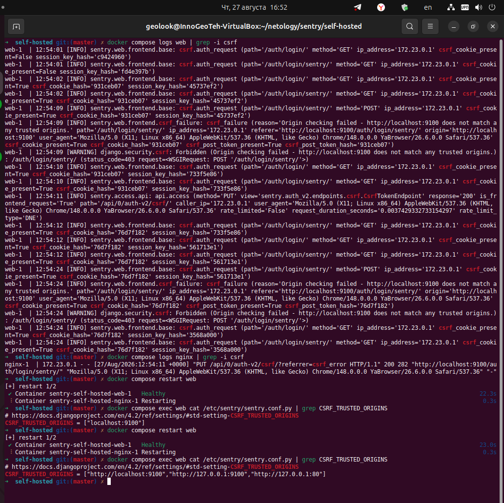
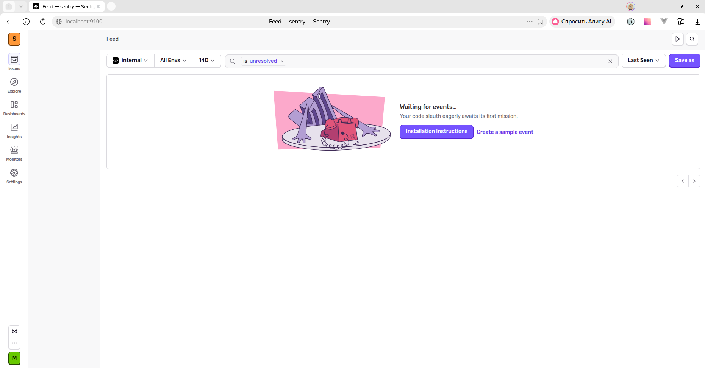
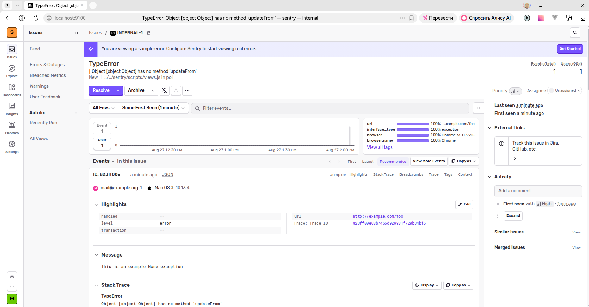
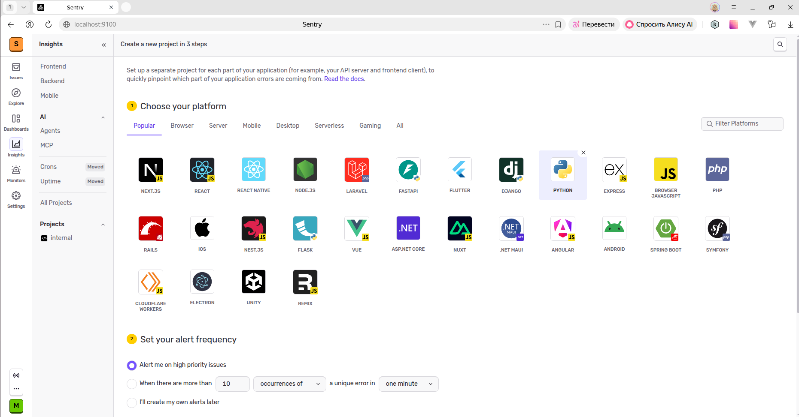
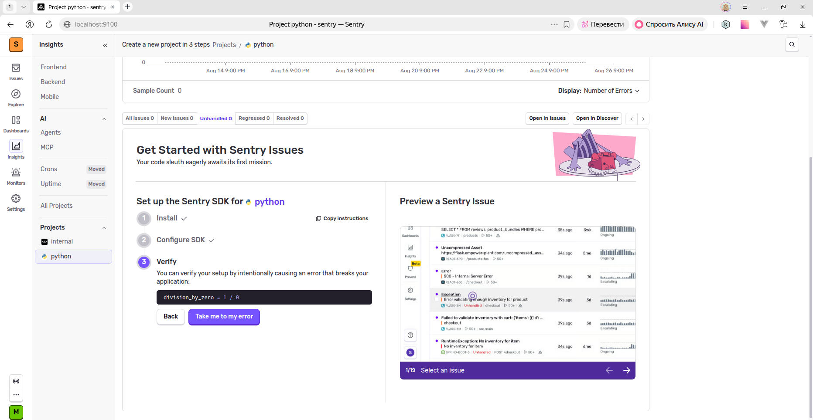
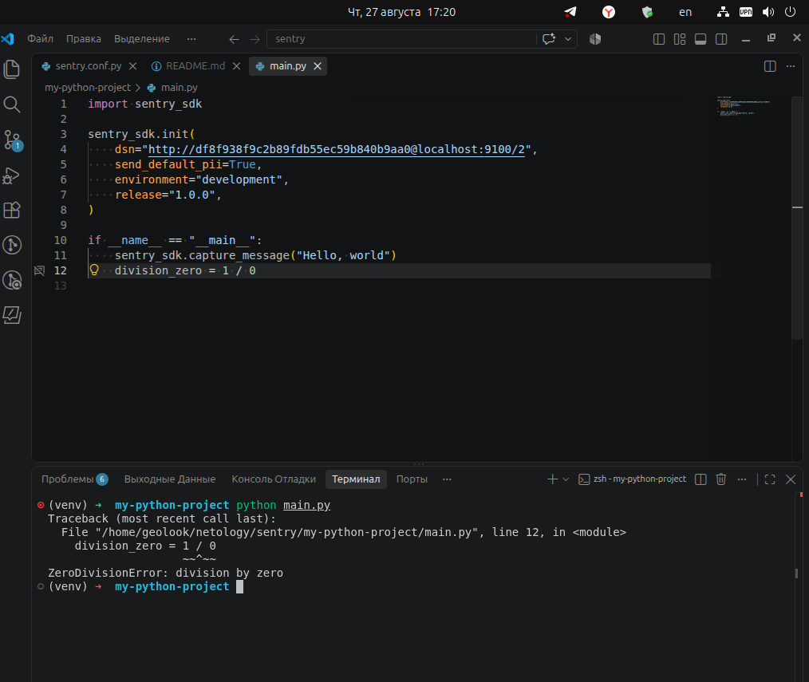
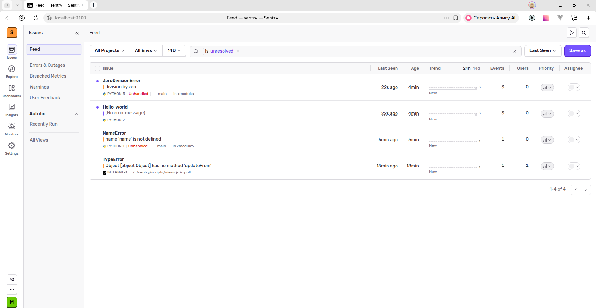
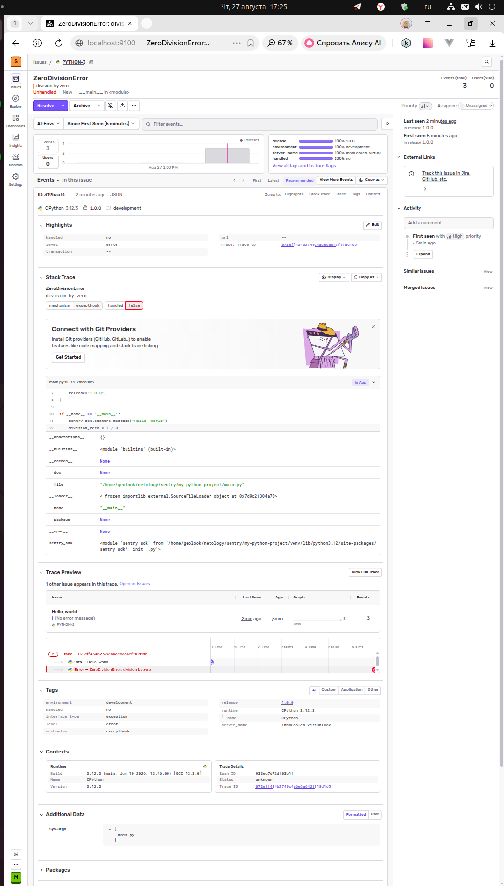
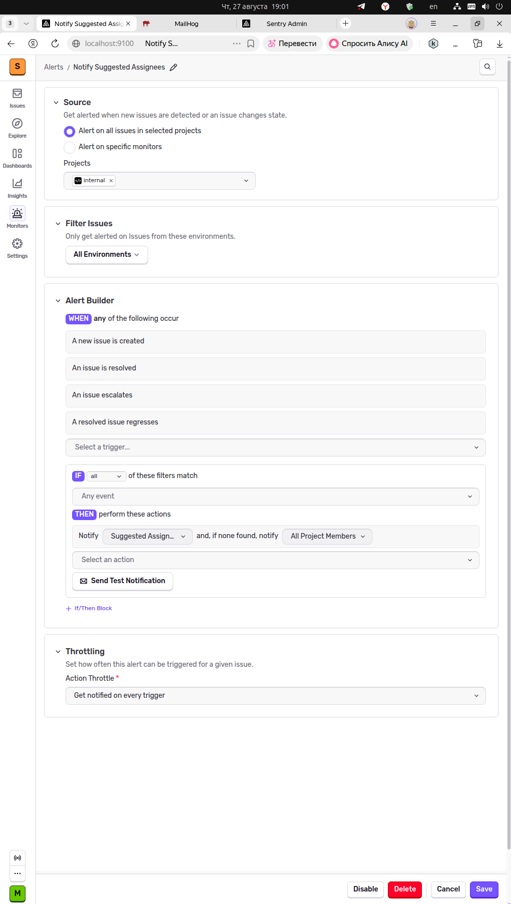
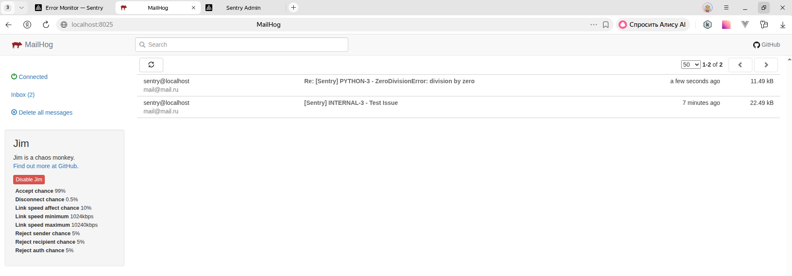

# Домашнее задание к занятию 16 «Платформа мониторинга Sentry»

## Задание 1

Так как Self-Hosted Sentry довольно требовательная к ресурсам система, мы будем использовать Free Сloud account.

Free Cloud account имеет ограничения:

- 5 000 errors;
- 10 000 transactions;
- 1 GB attachments.

Для подключения Free Cloud account:

- зайдите на sentry.io;
- нажмите «Try for free»;
- используйте авторизацию через ваш GitHub-аккаунт;
- далее следуйте инструкциям.

В качестве решения задания пришлите скриншот меню Projects.

## Задание 2

1. Создайте python-проект и нажмите `Generate sample event` для генерации тестового события.
1. Изучите информацию, представленную в событии.
1. Перейдите в список событий проекта, выберите созданное вами и нажмите `Resolved`.
1. В качестве решения задание предоставьте скриншот `Stack trace` из этого события и список событий проекта после нажатия `Resolved`.

## Задание 3

1. Перейдите в создание правил алёртинга.
2. Выберите проект и создайте дефолтное правило алёртинга без настройки полей.
3. Снова сгенерируйте событие `Generate sample event`.
Если всё было выполнено правильно — через некоторое время вам на почту, привязанную к GitHub-аккаунту, придёт оповещение о произошедшем событии.
4. Если сообщение не пришло — проверьте настройки аккаунта Sentry (например, привязанную почту), что у вас не было 
`sample issue` до того, как вы его сгенерировали, и то, что правило алёртинга выставлено по дефолту (во всех полях all).
Также проверьте проект, в котором вы создаёте событие — возможно алёрт привязан к другому.
5. В качестве решения задания пришлите скриншот тела сообщения из оповещения на почте.
6. Дополнительно поэкспериментируйте с правилами алёртинга. Выбирайте разные условия отправки и создавайте sample events. 

## Задание повышенной сложности

1. Создайте проект на ЯП Python или GO (около 10–20 строк), подключите к нему sentry SDK и отправьте несколько тестовых событий.
2. Поэкспериментируйте с различными передаваемыми параметрами, но помните об ограничениях Free учётной записи Cloud Sentry.
3. В качестве решения задания пришлите скриншот меню issues вашего проекта и пример кода подключения sentry sdk/отсылки событий.

---

### Как оформить решение задания

Выполненное домашнее задание пришлите в виде ссылки на .md-файл в вашем репозитории.

---
---

# Выполнение домашнего задания

## Задание 1

sentry.io в настоящее время не доступно, выполнено локальное развёртывание.  

Скачивание проекта:  
```sh
git clone https://github.com/getsentry/self-hosted.git
cd self-hosted
```

Кастомизация порта (стандартный был занят) - `.env` (в той же папке):  
```dotenv
SENTRY_BIND=9100
```

Запуск установщика (при установке отказался от отправки статистики и задал email/pass):  
```bash
sudo ./install.sh
```

После сборки создаются контейнеры, но не запускаются, поэтому требуется запуск:  
```bash
sudo docker compose up -d
```

В интерфейс не пускало, пришлось изменить настройки Sentry - `self-hosted/sentry/sentry.conf.py`:  
```dotenv
CSRF_TRUSTED_ORIGINS = ["http://localhost:9100","http://127.0.0.1:9100","http://127.0.0.1:80"]
ALLOWED_HOSTS = ["*"]
```

Применение параметров после редактирования файлов:  
]


Скриншот интерфейса Sentry после изменений:  


Пример конфигурации:  


## Задание 2

Создание нового проекта для Python:  


Пример быстрого старта и проверки для Python:  


Запуск приложения Python:  


Обзор ошибок:  


Обзор ошибки деления на 0:  


## Задание 3

Создание оповещения:  


Обзор писем - тестовое и по ошибке:  


Обзор письма о назначении ответственным по ошибке:  


